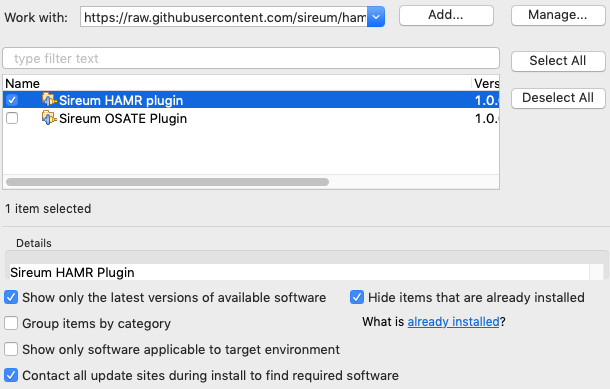
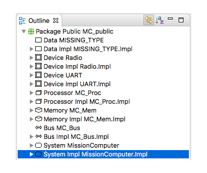

# Github hosted Sireum HAMR Plugin Update Site

Built against Sireum Kekinian Build 20200509.493c287* - To install Kekinian see [https://github.com/sireum/kekinian/tree/493c287#installing](https://github.com/sireum/kekinian/tree/493c287#installing)

## Installation

### From within OSATE

1. Install and launch [OSATE](http://osate.org/download-and-install.html)

2. Navigate to ``Help > Install New Software ...``

3. Click ``Add...`` and in the ``Location:`` field paste the following URL

    https://raw.githubusercontent.com/sireum/hamr-plugin-update-site/master/
   
4. Uncheck the ``Group items by category`` checkbox
 
5. Check the box for ``Sireum HAMR Plugin`` and click ``Finish``

   

### From within FM-IDE

The latest HAMR plugin is pre-installed in FM-IDE [releases](https://github.com/loonwerks/formal-methods-workbench/releases)

## Usage
1. Select a system implementation from the outline outline view.

   
 
2. Click the HAMR icon from the toolbar

   

3. Select the appropriate options and click ``Run``.
